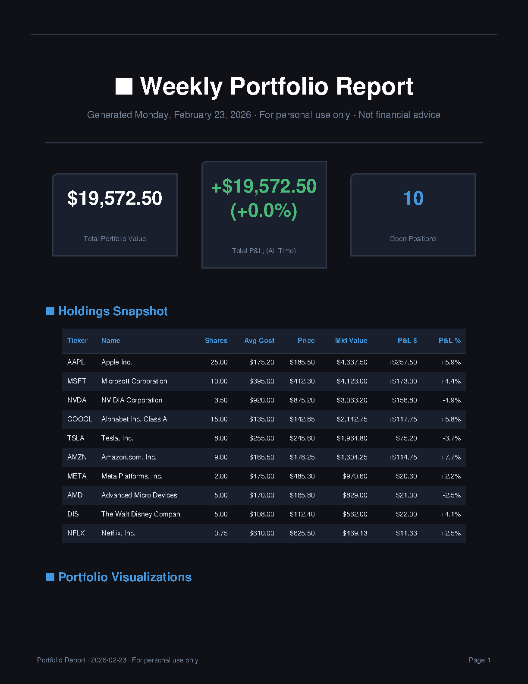
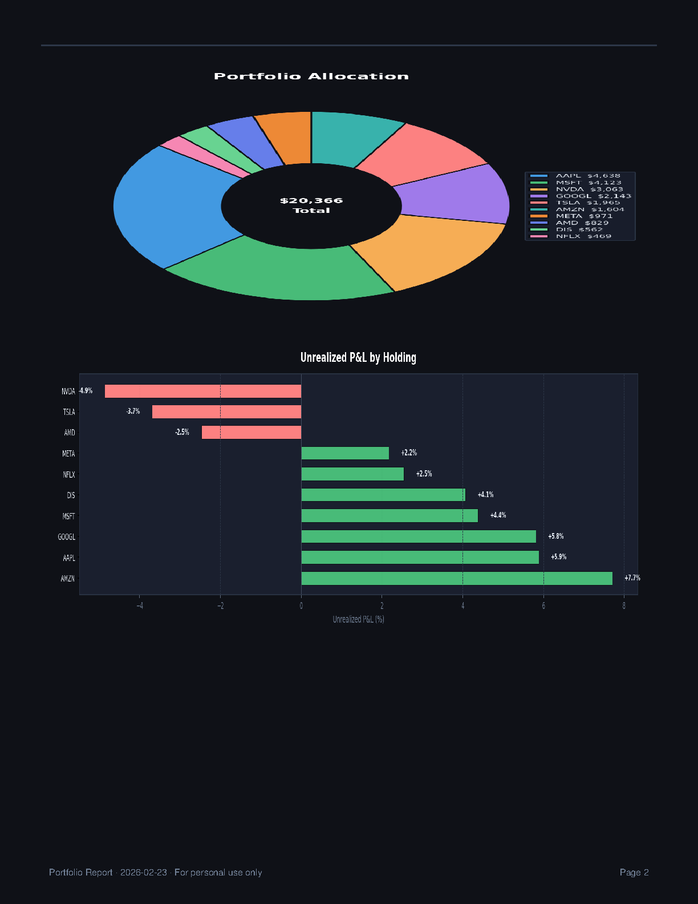
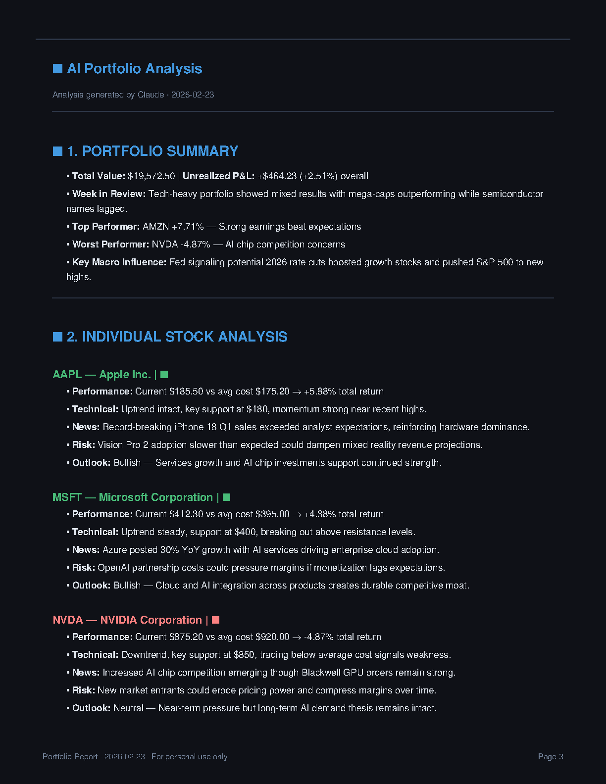

# Robinhood Portfolio Report Generator

Automatically generate a beautiful, AI-powered weekly PDF report of your Robinhood portfolio — with news, charts, analysis, and optional email delivery.

## Sample Report







A full sample PDF is available at [`assets/Sample_Report.pdf`](assets/Sample_Report.pdf).

---

## What It Does

Each time you run it, the tool:

1. Logs in to your Robinhood account and fetches your current holdings and P&L
2. Searches the web for recent news about each of your holdings and the broader market
3. Sends your portfolio data + news to Claude (Anthropic's AI) to generate a structured analysis
4. Assembles a multi-page PDF with KPI cards, a holdings table, allocation + P&L charts, and the AI analysis
5. Optionally emails the PDF to you and/or schedules itself to run every Sunday automatically

---

## Prerequisites

- Python 3.9+
- A Robinhood account
- API keys for [Anthropic](https://console.anthropic.com) and [Tavily](https://tavily.com)
- (Optional) A Gmail account with an App Password for email delivery

---

## Installation

```bash
# 1. Clone the repository
git clone <repo-url>
cd robinhood-report

# 2. Create and activate a virtual environment
python3 -m venv venv
source venv/bin/activate        # macOS / Linux
# venv\Scripts\activate         # Windows

# 3. Install dependencies
pip install -r requirements.txt
```

---

## Configuration

All secrets are read from **environment variables** — nothing is hard-coded. Add the following to your `~/.zshrc` (macOS/Linux) or set them in your shell before running:

```bash
# Required
export ROBINHOOD_EMAIL="your-robinhood-email@example.com"
export ROBINHOOD_PASSWORD="your-robinhood-password"
export ANTHROPIC_API_KEY="sk-ant-..."
export TAVILY_API_KEY="tvly-..."

# Optional — email delivery
export EMAIL_SENDER="your-email@gmail.com"
export EMAIL_PASSWORD="xxxx xxxx xxxx xxxx"   # Gmail App Password
export EMAIL_RECIPIENT="your-email@gmail.com" # defaults to EMAIL_SENDER
```

Then reload your shell:

```bash
source ~/.zshrc
```

For a full email setup walkthrough (Gmail, Outlook, Yahoo, custom SMTP) see [EMAIL_SETUP.md](EMAIL_SETUP.md).

---

## Running Manually

```bash
# Activate the virtual environment first
source venv/bin/activate

# Generate report and open the PDF automatically
python3 weekly_report_gen.py

# Generate report without opening the PDF (e.g. for servers / headless environments)
python3 weekly_report_gen.py --no-open
```

The PDF is saved to `Portfolio_Reports/report_YYYY-MM-DD.pdf`.

> **First run — Robinhood 2FA:** If your Robinhood account has two-factor authentication enabled (SMS or authenticator app), you will be prompted to enter your 2FA code in the terminal on the first run. After a successful login, `robin_stocks` caches a session token locally so subsequent runs do not require the code again until the token expires.

---

## Optional: Disable Email

Email is enabled by default once you set `EMAIL_SENDER` and `EMAIL_PASSWORD`. To turn it off:

```python
# In weekly_report_gen.py, line ~46
SEND_EMAIL = False
```

---

## Automated Weekly Schedule (macOS)

The included `run_report.sh` script is ready to be wired into macOS's `launchd` scheduler so the report runs every Sunday at 9 AM automatically.

### Step 1 — Make the script executable

```bash
chmod +x run_report.sh
```

### Step 2 — Create the launchd plist

Create the file `~/Library/LaunchAgents/com.user.robinhood-report.plist`:

```xml
<?xml version="1.0" encoding="UTF-8"?>
<!DOCTYPE plist PUBLIC "-//Apple//DTD PLIST 1.0//EN"
  "http://www.apple.com/DTDs/PropertyList-1.0.dtd">
<plist version="1.0">
<dict>
    <key>Label</key>
    <string>com.user.robinhood-report</string>

    <key>ProgramArguments</key>
    <array>
        <string>/bin/bash</string>
        <string>/FULL/PATH/TO/robinhood-report/run_report.sh</string>
    </array>

    <key>StartCalendarInterval</key>
    <dict>
        <key>Weekday</key> <integer>0</integer>  <!-- 0 = Sunday -->
        <key>Hour</key>    <integer>9</integer>
        <key>Minute</key>  <integer>0</integer>
    </dict>

    <key>StandardOutPath</key>
    <string>/Users/YOUR_USERNAME/Library/Logs/robinhood-report.log</string>
    <key>StandardErrorPath</key>
    <string>/Users/YOUR_USERNAME/Library/Logs/robinhood-report.error.log</string>
</dict>
</plist>
```

Replace `/FULL/PATH/TO/robinhood-report/` and `YOUR_USERNAME` with your actual values.

### Step 3 — Load the job

```bash
launchctl load ~/Library/LaunchAgents/com.user.robinhood-report.plist
```

### Useful scheduler commands

```bash
# Check job is registered
launchctl list | grep robinhood-report

# Trigger a test run immediately
launchctl start com.user.robinhood-report

# View logs
tail -f ~/Library/Logs/robinhood-report.log
tail -f ~/Library/Logs/robinhood-report.error.log

# Disable the schedule
launchctl unload ~/Library/LaunchAgents/com.user.robinhood-report.plist

# Re-enable
launchctl load ~/Library/LaunchAgents/com.user.robinhood-report.plist
```

For Linux, the equivalent is a `cron` job:

```bash
# Open crontab editor
crontab -e

# Run every Sunday at 9:00 AM
0 9 * * 0 /bin/bash /full/path/to/robinhood-report/run_report.sh >> ~/robinhood-report.log 2>&1
```

---

## Project Structure

```
robinhood-report/
├── weekly_report_gen.py   # Main script — report generation pipeline
├── email_sender.py        # Optional email delivery module
├── run_report.sh          # Shell wrapper for scheduled execution
├── requirements.txt       # Python dependencies
├── README.md              # This file
├── EMAIL_SETUP.md         # Detailed email configuration guide
├── SCHEDULER_README.md    # Scheduler setup and management guide
├── PRIVACY_AND_FAQ.md     # Data privacy, costs, and API details
├── assets/                # Screenshots and sample report
│   ├── Sample_Report.pdf
│   └── screenshot_*.png
└── Portfolio_Reports/     # Output directory (auto-created, gitignored)
    └── report_YYYY-MM-DD.pdf
```

---

## Dependencies

| Package | Purpose |
|---|---|
| `robin-stocks` | Robinhood portfolio data |
| `anthropic` | Claude AI for analysis |
| `tavily-python` | Web search for stock news |
| `reportlab` | PDF generation |
| `matplotlib` | Portfolio charts |
| `numpy` | Chart data processing |

---

## Important Notices

- **Not financial advice.** This tool is for personal informational use only. Nothing in the generated reports constitutes investment advice.
- **Unofficial Robinhood API.** `robin_stocks` is a community-maintained library. Robinhood may change their API at any time.
- **Your data stays local.** The generated PDF is saved on your machine. It is only emailed if you configure email delivery.

For detailed information on data privacy, API costs, and security, see [PRIVACY_AND_FAQ.md](PRIVACY_AND_FAQ.md).
